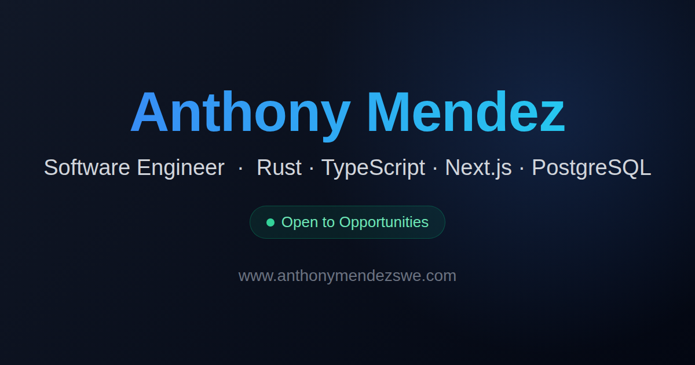

# anthonymendezswe.com

Personal portfolio of Anthony Mendez — Software Engineer.

**Live site:** https://www.anthonymendezswe.com



## Tech stack

- [Next.js 15](https://nextjs.org) (App Router, fully static prerender)
- React 19 + TypeScript
- Tailwind CSS v4
- Deployed on Vercel with Analytics and Speed Insights

## Highlights

- All content lives in `src/data/` (projects, skills, personal info) — components only render, so content edits never touch JSX
- Project demo videos lazy-play via `IntersectionObserver`, with generated poster frames, and stay paused for visitors who prefer reduced motion
- Unified dark color system with WCAG AA contrast, visible keyboard focus states, and semantic accent colors
- SEO: Open Graph card, JSON-LD `Person` schema, `sitemap.xml`, and `robots.txt`

## Development

```bash
npm install
npm run dev     # local dev server with Turbopack
npm run build   # production build
npm run lint    # ESLint
```
